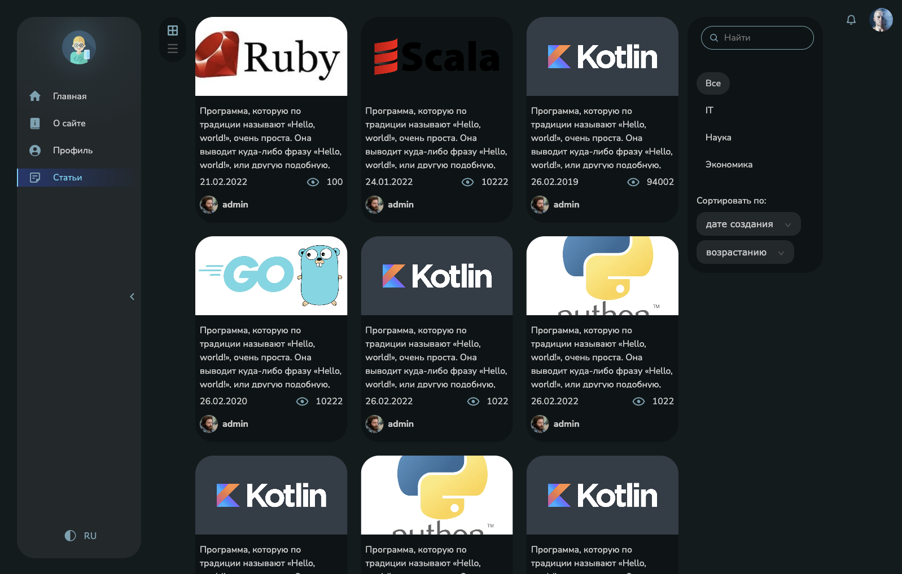

# Пример проекта на архитектуре FSD

Приложение представляет собой простой блог с фейковым API (json-server) и следующим функционалом:
- Архитектура по FSD с разделением на слои и слайсы
- Feature-флаги и автоматическое удаление кода, спрятанного за фича-флагами
- Переключение тем и языков
- Переключение на старый/новый дизайн
- Настройки пользователя через Json-settings
- Покрытие unit и e2e тестами
- Storybook на компоненты
- Классический набор функционала - логин, приватные роуты по ролям, пагинация и бесконечный скролл, скелетоны, сортировки, попапы, шторки, списки и тп.

---
https://blog-nu-jet.vercel.app



---

## Запуск проекта

```
npm install - устанавливаем зависимости
npm run start:dev или npm run start:dev:vite - запуск сервера + frontend проекта в dev режиме
```

----

## Скрипты

- `npm run start` - Запуск frontend проекта на webpack dev server
- `npm run start:dev` - Запуск frontend проекта на webpack dev server + backend
- `npm run start:dev:vite` - Запуск frontend проекта на vite + backend
- `npm run build:prod` - Сборка в prod режиме
- `npm run build:dev` - Сборка в dev режиме (не минимизирован)
- `npm run lint` - Проверка ts файлов линтером
- `npm run lint:fix` - Исправление ts файлов линтером
- `npm run lint:scss` - Проверка scss файлов style линтером
- `npm run lint:scss-fix` - Исправление scss файлов style линтером
- `npm run test:unit` - Запуск unit тестов с jest
- `npm run test:ui` - Запуск скриншотных тестов с loki
- `npm run test:ui-approve` - Подтверждение новых скриншотов
- `npm run test:ui-ci` - Запуск скриншотных тестов в CI
- `npm run test:ui-report` - Генерация полного отчета для скриншотных тестов
- `npm run storybook` - запуск Storybook
- `npm run storybook:build` - Сборка storybook билда
- `npm run prepare` - прекоммит хуки
- `npm run postinstall` - выполняет очистку кеша после установки пакетов
- `npm run remove-features` - удаляет код под feature-флагом

----

## Архитектура проекта

Проект написан в соответствии с методологией Feature sliced design

Ссылка на документацию - [feature sliced design](https://feature-sliced.design/docs/get-started/tutorial)

----

## Работа с переводами

В проекте используется библиотека i18next для работы с переводами.
Файлы с переводами хранятся в public/locales.

Для комфортной работы рекомендуем установить плагин для webstorm/vscode

Документация i18next - [https://react.i18next.com/](https://react.i18next.com/)

----

## Тесты

В проекте используются 4 вида тестов:
1) Обычные unit тесты на jest - `npm run test:unit`
2) Тесты на компоненты с React testing library -`npm run test:unit`
3) Скриншотное тестирование с loki `npm run test:ui`
4) e2e тестирование с Cypress `npm run test:e2e`

Подробнее о тестах - [документация тестирование](docs/tests.md)

----

## Линтинг

В проекте используется eslint для проверки typescript кода и stylelint для проверки файлов со стилями.

Также для строгого контроля главных архитектурных принципов
используется собственный eslint plugin *fsd-path-checker* (подключается локально через `npm link eslint-plugin-fsd-path-checker`),
который содержит 3 правила
1) path-checker - запрещает использовать абсолютные импорты в рамках одного модуля
2) layer-imports - проверяет корректность использования слоев с точки зрения FSD
   (например widgets нельзя использовать в features и entitites)
3) public-api-imports - разрешает импорт из других модулей только из public api. Имеет auto fix

##### Запуск линтеров
- `npm run lint:ts` - Проверка ts файлов линтером
- `npm run lint:fix` - Исправление ts файлов линтером
- `npm run lint:scss` - Проверка scss файлов style линтером
- `npm run lint:scss-fix` - Исправление scss файлов style линтером

----
## Storybook

В проекте для каждого компонента описываются стори-кейсы.
Запросы на сервер мокаются с помощью storybook-addon-mock.

Файл со сторикейсами создает рядом с компонентом с расширением .stories.tsx

Подробнее о [Storybook](docs/storybook.md)

----

## Конфигурация проекта

Для разработки проект содержит 2 конфига:
1. Webpack - ./config/build
2. vite - vite.config.ts

Оба сборщика адаптированы под основные фичи приложения.

Вся конфигурация хранится в /config
- /config/babel - babel
- /config/build - конфигурация webpack
- /config/jest - конфигурация тестовой среды
- /config/storybook - конфигурация сторибука

В папке `scripts` находятся различные скрипты для рефакторинга\упрощения написания кода\генерации отчетов и тд.

----

## CI pipeline и pre commit хуки

Конфигурация github actions находится в /.github/workflows.
В ci прогоняются все виды тестов, сборка проекта и сторибука, линтинг.

В прекоммит хуках проверяем проект линтерами, конфиг в /.husky

----

## Работа с данными

Взаимодействие с данными осуществляется с помощью redux toolkit.
По возможности переиспользуемые сущности необходимо нормализовать с помощью EntityAdapter

Запросы на сервер отправляются с помощью [RTK query](src/shared/api/rtkApi.ts)

Для асинхронного подключения редюсеров (чтобы не тянуть их в общий бандл) используется
[useDynamicReducerLoader](src/shared/hooks/useDynamicReducerLoader/useDynamicReducerLoader.ts)

----

## Работа с feature-flags

Разрешено использование feature flags только с помощью хелперов `toggleFeatures` и `ToggleFeaturesWrapper`

в него передается объект с опциями:
```
{
name: название фича-флага,
on: функция, которая отработает после Включения фичи
of: функция, которая отработает после ВЫключения фичи
}
```

Для автоматического удаления фичи использовать скрипт [removeFeatures.ts](scripts/removeFeatures.ts),
который принимает 2 аргумента
1. Название удаляемого фича-флага
2. Состояние (on\off)

----

## Сущности (entities)

- [Article](src/entities/Article/README.md)
- [Comment](src/entities/Comment/README.md)
- [Country](src/entities/Country/README.md)
- [Currency](src/entities/Currency/README.md)
- [Notification](src/entities/Notification/README.md)
- [ProfileCard](src/entities/ProfileCard/README.md)
- [Rating](src/entities/Rating/README.md)
- [User](src/entities/User/README.md)

## Фичи (features)

```
TODO: Добавить список фичей со ссылками на описание каждой фичи
```
